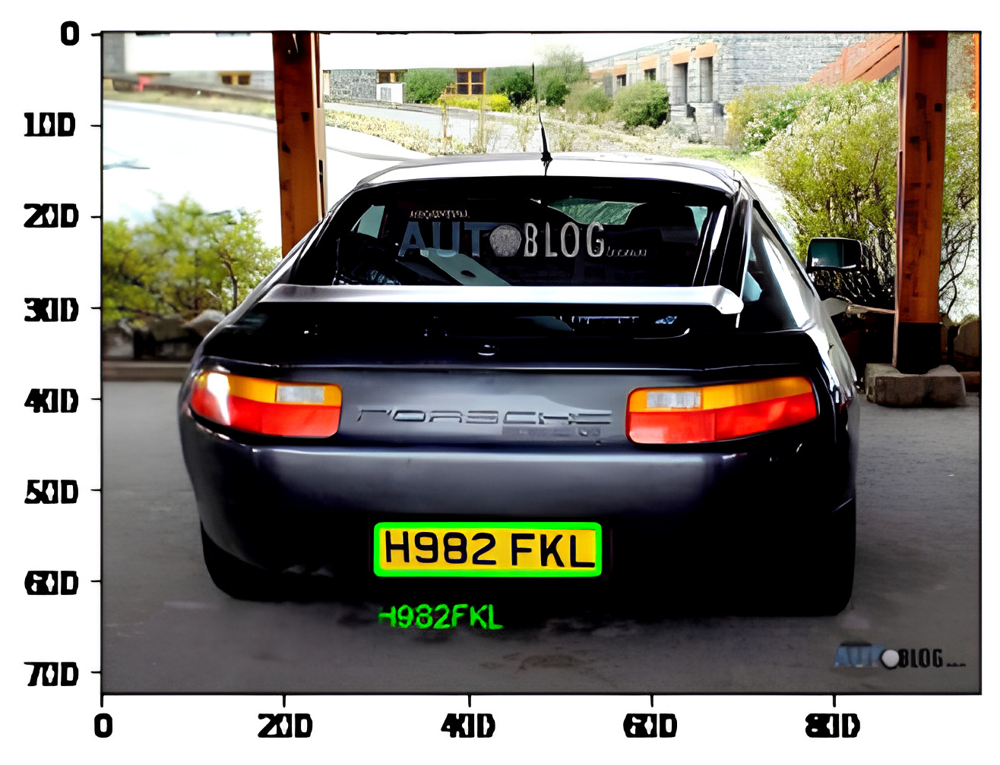

# 🚗 License Plate OCR

A Python-based license plate recognition system that detects and extracts license plates from vehicle images using OpenCV and EasyOCR. It combines image preprocessing, contour detection, and optical character recognition to accurately identify plate numbers from photos.

---

## 📸 Demo

  
*Replace with your own image/GIF or remove this section.*

---

## 🛠️ Features

- 🔍 Detects and isolates vehicle license plates using OpenCV  
- ✨ Preprocesses images with noise reduction and edge detection  
- 🔲 Identifies rectangular plate areas via contour analysis  
- 🔡 Extracts text from license plates using EasyOCR  
- 💯 High accuracy on clean vehicle images  

---

## 📂 Project Structure

